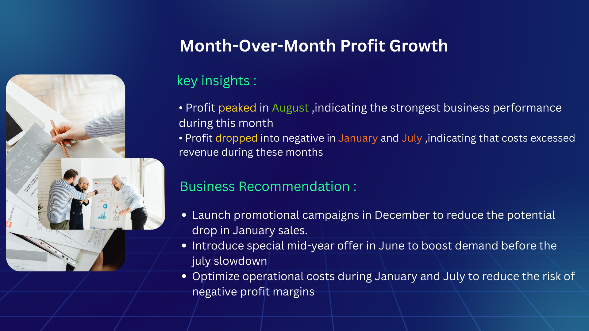
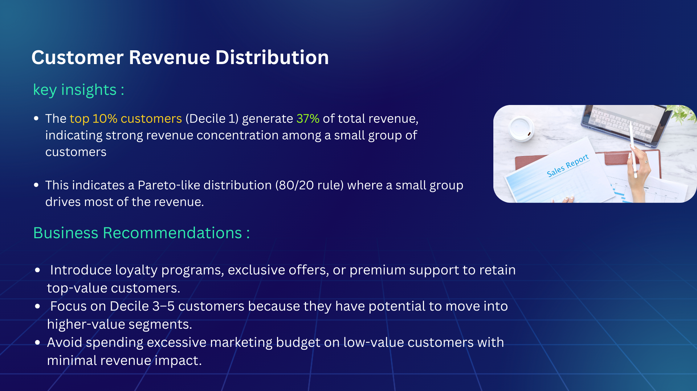
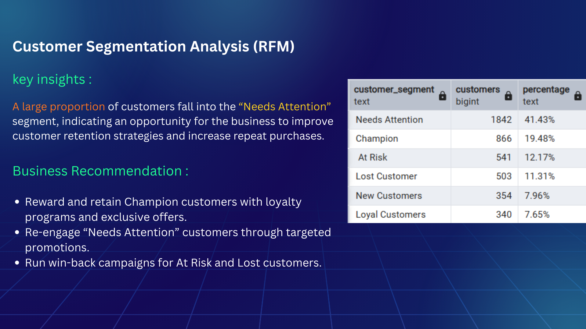
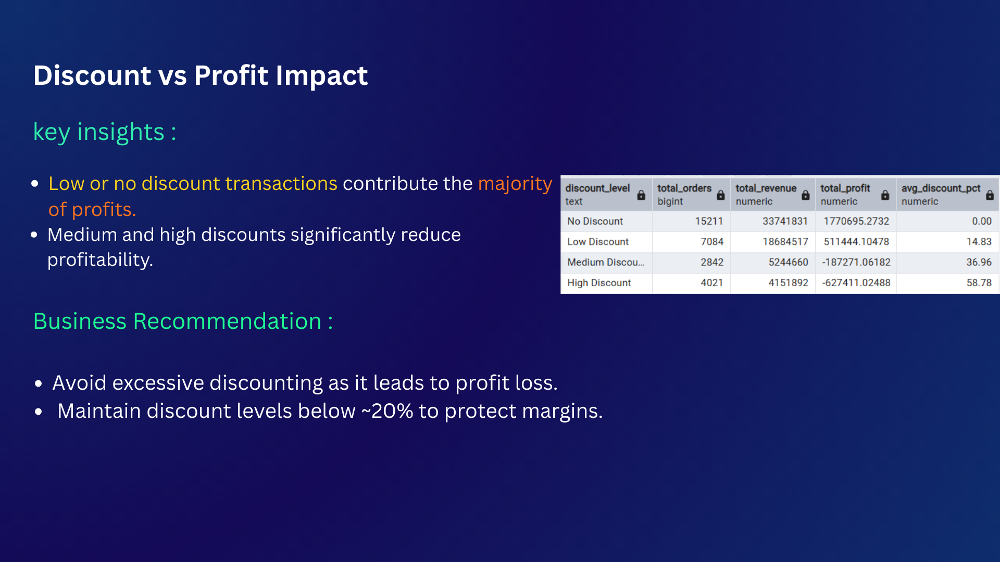
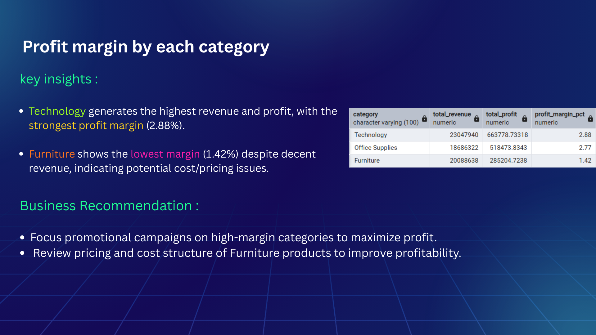
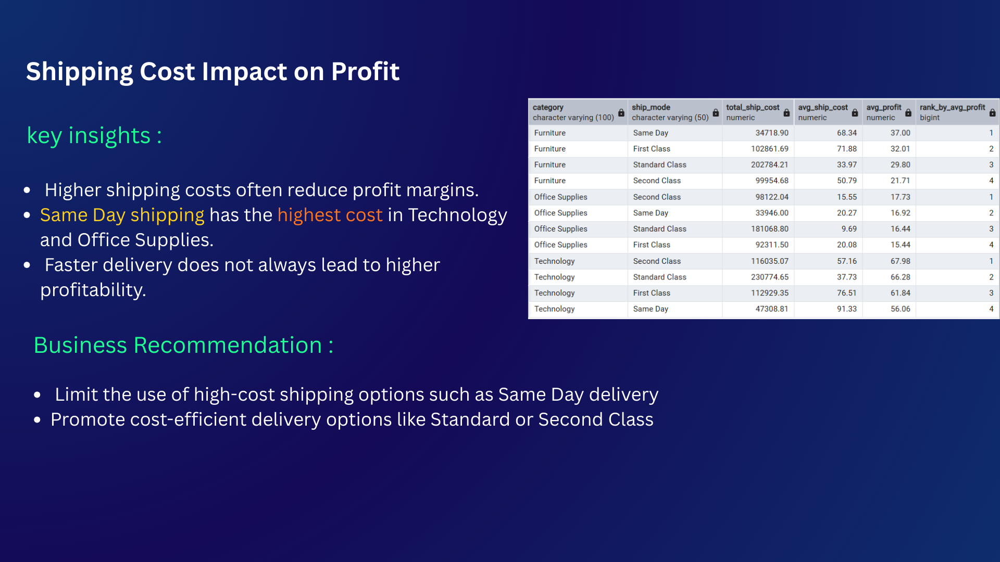

# 🛒 Global Superstore Sales & Customer Analysis


---

## 📌 Project Overview

This project analyzes **4 years of transaction data (2011–2014)** from Global Superstore — an international retail company selling Furniture, Office Supplies, and Technology products.

Using **SQL (PostgreSQL)**, the analysis uncovers revenue trends, customer behavior, profitability drivers, and operational inefficiencies to support better business decision-making.

---

## 📌 Business Problem

Retail businesses often struggle to identify which customers, products, and operational strategies drive profitability.
This project aims to analyze sales performance and identify the key drivers of revenue growth and profit margins.

---

## ❓ Key Business Questions Explored
1. How does revenue change month-over-month?
2. Which customers contribute the most revenue?
3. How are customers segmented using RFM analysis?
4. How do discounts impact profitability?
5. Which shipping mode delivers the best value?
6. Which products generate losses?
7. How does shipping cost affect overall profit?
*Insights derived from 12+ SQL analyses.*

-----

## 📊 Dataset

| Property | Details |
|---|---|
| Source | Global Superstore Sales Dataset |
| Period | 2011 – 2014 |
| Total Rows | 51,290 |
| Total Customers | 4,873 |
| Total Orders | 25,035 |
| Total Revenue | $61.8M |
| Categories | 3 (Furniture, Office Supplies, Technology) |

---

## 🛠️ Tools Used

| Tool | Purpose |
|---|---|
| PostgreSQL | Data storage & SQL queries |
| pgAdmin 4 | Query execution & output |
| Canva | Presentation slides |

---

## 📁 Project Structure

```
global-superstore-sales-analysis/
│
├── data/
│   └── Global_Superstore.csv
│
├── sql_queries/
│   ├── data_overview.sql
│   ├── sales_trend_analysis.sql
│   ├── customer_analysis.sql
│   ├── product_profitability.sql
│   ├── discount_analysis.sql
│   ├── shipping_analysis.sql
│
├── presentation/
│   └── superstore_analysis.pdf
│
├── screenshots/
│   ├── mom_profit_growth.png
│   ├── high_value_customers.png
│   ├── rfm_segmentation.png
│   ├── profit_margin.png
│   ├── discount_impact.png
│   └── shipping_cost_analysis.png
│
└── README.md
```
---

## 🔍 Key Findings

- ⭐ **Top 10% of customers** drive **37% of total revenue**
- 💰 **High discounts** are causing **$814K in profit losses**
- 📦 **Furniture profit margin is only 1.42%** despite generating $20M in revenue
- 🚚 **First Class shipping cost** is nearly **2x the profit** it generates for Furniture
- 📈 **Revenue grew 87%** from 2011 to 2014
- 📅 **January & July** show consistent revenue drops every year
- 🎯 **41% of customers** fall in the "Needs Attention" RFM segment — biggest opportunity

---

## 💡 Business Recommendations

1. **Protect Champion segment (19%)** with exclusive VIP loyalty program
2. **Cap discounts at 20% maximum** — Medium & High discounts are generating losses
3. **Review Furniture pricing strategy** — highest revenue category but lowest margin (1.42%)
4. **Switch Furniture orders to Standard Class shipping** to reduce costs
5. **Run promotional campaigns in June & December** before seasonal revenue drops
6. **Win-back campaign for At Risk + Lost customers (23%)** with personalized offers

---

## 📸 Project Snapshots

### 📈 Month-Over-Month Revenue Growth


### 👥 High Value Customer Analysis


### 🎯 RFM Customer Segmentation


### 💰 Discount Impact on Profitability


### 📦 Profit Margin by Category


### 🚚 Shipping Cost Analysis


---

## ▶️ How to Run

1. Clone this repository
2. Download dataset from `data/` folder
3. Create a new database in PostgreSQL
4. Import `Global_Superstore.csv` into a table named `orders`
5. Run queries from `queries/` folder in order (01 → 11)

---

## 📬 Connect With Me

**Rafat Khan** — Aspiring Data Analyst

- 💼 LinkedIn: [[Your LinkedIn URL](https://www.linkedin.com/in/rafat-khan-7215953a1/)]
- 🐙 GitHub: [github.com/Rafat-khan10](https://github.com/Rafat-khan10)
- 📧 Email: [rafatkhan2210@gmail.com]
